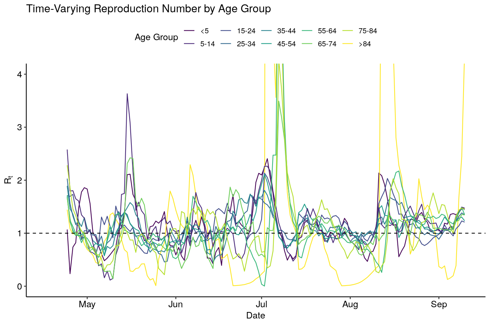

# Age Heterogenity in COVID-19 Cases in Austria
An exploration of different aspects of the age distribution of new COVID-19
cases in Austria based upon a data lake of snapshots of the open government
data. 


<br/><br/>



<br/><br/>


## Installation

### R Packages
To install the required R packages you need to have `renv` installed. Then
just run:

```
renv::restore()
```

### External Data

If you want to run a new analysis then you need to clone the 
[data lake of the Austrian governments open data COVID-19 updates](https://github.com/keriati/austria-covid-data) 
into the `external_data` folder:

```
mkdir external_data
cd external_data
git clone https://github.com/keriati/austria-covid-data.git
```

## Running

- [Rt and incidence by age-group](R/Rt-by-age-group.R)
- [Density of new COVID-19 cases by age-group](R/age-density-plot.R)